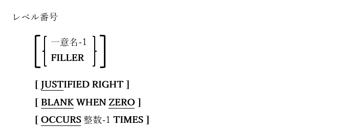
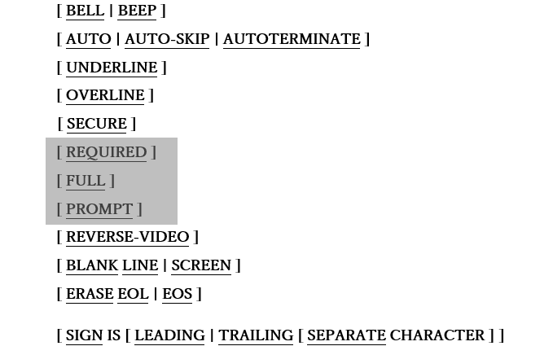

<!--navi start1-->
[前へ](5-5.md)/[目次](https://momo2584.github.io/opensourcecobol.github.io/markdown/TOC.html)/[次へ](6-1-1.md)
<!--navi end1-->
## 5.6. 画面記述

図5-14-画面節データ項目記述構文




上に示した構文の枠組みは、画面節でデータ項目がどのように定義されているかを表す。これらのデータ項目は、特別な形式のACCEPT文([6.4](6-4-1.md))およびDISPLAY文([6.14.4](6-14-4.md))を介して使用され、TUI(「テキストユーザインターフェース」プログラム)を作成する。

1. レベル番号66、78および88のデータ項目は画面節で使用でき、他のデータ部節と同じ構文、規則、使用法である。

2. BELL句またはBEEP句(どちらも同義語である)を利用して、画面項目が表示されているとき可聴音を鳴らす。

3. AUTO句(三つある形式はすべて同じ)は、AUTO句のある項目が完全に入力されているとき、次の入力可能項目へと自動で進むカーソルが表示される。

4. UNDERLINE句とOVERLINE句は、現時点ではWindowsのコンソールウィンドウAPIでサポートされていないため、Windowsシステムでは基本的に機能しない。しかしUNDERLINE句は、FOREGROUND-COLOR属性によって指定された(または暗黙の)値に関係なく、項目の前景色を青に表示する効果がある。これらの句がUNIXシステムで機能するか否かは、使用する出力端末のビデオ属性によって異なる。

5. SECURE属性は、データ入力(USINGまたはTO)を許可する項目でのみ使用できる。この属性によって、項目に入力されたデータはすべて、アスタリスクとして表示される。

6. REQUIRED属性とFULL属性は、構文的には適切であるが、機能はしない。

7. PROMPT属性は、すべての入力項目の既定の動作となっているため、opensource COBOLでは不要である。`11`

8. REVERSE-VIDEO属性は、指定または暗黙のFOREGROUND-COLOR属性とBACKGROUND-COLOR属性の意味を逆にする。

9. BLANK句は、データ項目のLINE句やCOLUMN句で示されたポイントから、画面または行を空白にする。さらに、コンソールウィンドウの前景色と背景色は、項目で指定されている色に設定される。レベル01項目(または従属項目)内でこの句を使用すると、その項目内に表示されるすべての項目が非表示になる。

10. ERASE句は、コンソールウィンドウの最新行(EOL)または画面(EOS)の残りの部分を消去する。ERASE句が消去したり、前景色と背景色を設定する項目の最後の方から始めていき、ERASE句を含む項目に対して有効である。

11. LINE句またはCOLUMN句がない場合、画面節項目は画面項目を表すACCEPT文またはDISPLAY文によって、指定もしくは暗示される縦/横座標で始まるコンソールウィンドウに表示される。項目がコンソールウィンドウに表示された後、次の項目がその直後に表示される。

    LINE句とCOLUMN句は、コンソールウィンドウのどこに項目を表示するかを明示的に示す手段を提供する。座標は、絶対座標(「縦1横5」)または以前に提示された項目の終わりに基づく相対座標(「縦+2横+1」)で表すことができる。一意名や定数を使用して、絶対位置または相対位置を定義できる。一意名を使用する場合は、記号を編集しないPIC 9項目である必要がある(COMPUTATIONAL-1またはCOMPUTATIONAL-2を除く、任意の数値USAGEが許可される。浮動小数点USAGE仕様はそのどちらかは受け入れられるが、予測できない結果になることに注意)。

      もちろん、LINE句とCOLUMN句を使用せずに画面項目の暗黙的配置に依存している場合を除いて、項目は表示された縦/横の順序で定義する必要はない。

      TABキーとBACK-TAB(Shift-TAB)キーは、画面節で定義された順序に関係なく、コンソールウィンドウ上に項目が出現する縦/横の順序で、項目から項目へカーソルを配置する。

      必要に応じてCOLUMNはCOLに省略が可能である。

12. FOREGROUND-COLOR句とBACKGROUND-COLOR句は、テキスト(前景)または画面(背景)の色を指定するために使用される。以下のような番号(0~7)によって色を指定する。

    表5-15-番号によって指定される画面色

    | 整数 | 色 |
    | :---: | :---: |
    | 0 | 黒 |
    | 1 | 青 |
    | 2 | 緑 |
    | 3 | 青緑 |
    | 4 | 赤 |
    | 5 | 赤紫 |
    | 6 | 黄 |
    | 7 | 白 |

13. HIGHLIGHTおよびLOWLIGHTオプションは、テキストの輝度(前景)を制御する。これは3レベルの強度方式(LOWLIGHT、指定なし、HIGHLIGHT)の提供を目的としているが、Windowsのコンソールは2レベルまでをサポートしているため、LOWLIGHTはこの句を完全に省略した場合と同じである。この修飾子をFOREGROUND-COLOR属性に使用すると、次の表のように実際には8色だけでなく16色のテキストを使用できる。

    表5-16-LOWLIGHT/ HIGHLIGHTオプションによる画面色<br>


     | FOREGROUND-COLOR整数 | LOWLIGHT | HIGHLIGHT |
    | :---: | :---: |:---: |
    | 0 | 黒 | 暗灰 |
    | 1 | 暗青/藍 | 明青 |
    | 2 | 暗緑 | 明緑 |
    | 3 | 暗青緑 | 明青緑 |
    | 4 | 暗赤 | 明赤 |
    | 5 | 暗赤紫 | 明赤紫 |
    | 6 | 金/茶 | 黄 |
    | 7 | 明灰 | 白 |


14. BLINK属性は、BACKGROUND-COLOR仕様の外観を変更する。Windowsのコンソールは点滅をサポートしていないため、Windows版opensource COBOLにおけるBLINKの視覚効果は、LOWLIGHT/HIGHLIGHTと組み合わせたFOREGROUND-COLORにおいて可能であるのと同様の16色をBACKGROUND-COLORパレットに提供することである。

15. 前景色と背景色の属性は、他の項目から継承できる。前の項目からではなく、親のデータ項目(数値的に低いレベルのデータ項目)から継承される。以下の点に注意が必要である。

    ```
      78  Black             VALUE 0.
      78  Blue        VALUE 1.
      78  Green             VALUE 2.
      78  White              VALUE 7.
      ･･･
          02 XYZ BACKGROUND-COLOR Black FOREGROUND-COLOR Green ･･･
             05 ABC BACKGROUND-COLOR Blue FOREGROUND-COLOR White ･･･
            05 DEF (no BACKGROUND-COLOR or FOREGROUND-COLOR specified) ･･･
    ```
      DEF項目の色は緑と白になる(XYZから継承される)

16. VALUE句は変更できない固定のテキストを定義するために使用される。

17. FROM句は指定された定数または一意名から、内容を取得する必要がある項目を定義するために使用される。

18. TO句は初期値のないデータ入力項目を定義するために使用される。値を入力すると、指定した一意名に保存される。

19. USING句は「FROM一意名」と「TO一意名」の組み合わせである。

---
`11`PROMPT属性は、非空白文字でマークすることで表示されるようにした、空の入力項目の指定に使用される。この機能は、opensource COBOLにおける編集可能なすべての画面項目で常に有効になっている(空白に下線を引いた文字が使用されている)。

<!--navi start2-->

[ページトップへ](5-6.md)
<!--navi end2-->
