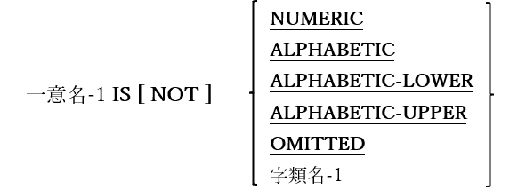
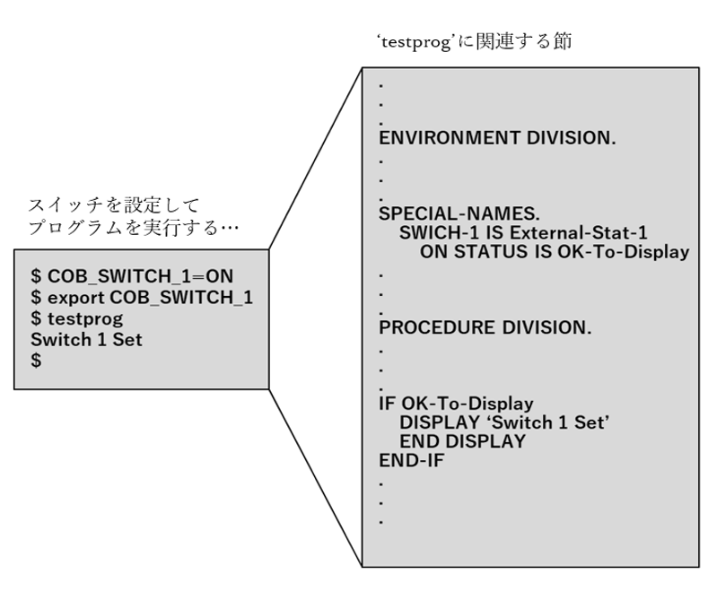
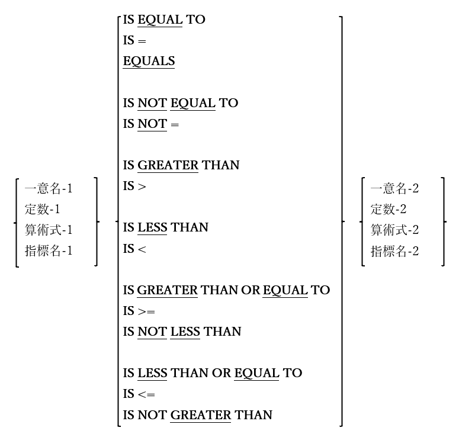
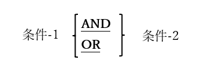

<!--navi start1-->
[前へ](6-1-4-1.md)/[目次](https://opensourcecobol.github.io/markdown/TOC.html)/[次へ](6-1-5.md)
<!--navi end1-->
#### 6.1.4.2. 条件式

条件式は、プログラムが実行する処理を決定する条件を識別する式であり、TRUE値またはFALSE値を生成する。条件式は難易度の高い順に以下の7種類がある。

##### 6.1.4.2.1. 条件名(レベル88項目)

次のコードは最も単純な条件の一例である。

```
    05 SHIRT-SIZE           PIC 99V9.
       88 LILLIPUTIAN       VALUE 0 THRU 12.5
       88 XS                VALUE 13 THRU 13.5.
       88 S                 VALUE 14, 14.5.
       88 M                 VALUE 15, 15.5.
       88 L                 VALUE 16, 16.5.
       88 XL                VALUE 17, 17.5.
       88 XXL               VALUE 18, 18.5.
       88 HUMUNGOUS         VALUE 19 THRU 99.9.
```

条件名「LILLIPUTIAN」、「XS」、「S」、「M」、「L」、「XL」、「XXL」、および「HUMONGOUS」は、親データ項目(SHIRT-SIZE)内の値に基づいて、TRUE値またはFALSE値を得る。したがって、現在のSHIRT-SIZE値を「XL」として分類できるかどうかをテストするプログラムでは、組み合わせ条件(最も複雑なタイプの条件式)として以下のようにコード化することで、判定することができる。


        IF SHIRT-SIZE = 17 OR SHIRT-SIZE = 17.5


または次のように条件名「XL」を使用することもできる。

        IF XL

##### 6.1.4.2.2. 字類条件

図6-9-字類条件構文



字類条件は、データ項目に格納されている現在のデータ型を判別する。

1. NUMERIC字類条件では、「0」、「1」、･･･、「9」の文字のみが数字であると判別され、数字だけを含むデータ項目のみがIS NUMERICクラステストを通過できる。空白、小数点、コンマ、通貨記号、プラス記号、マイナス記号、およびその他の数字以外の文字はすべてIS NUMERICクラステストを通過できない。

2. ALPHABETIC字類条件では、大文字、小文字、そして空白のみがアルファベットであると判別される。

3. ALPHABETIC-LOWERとALPHABETIC-UPPER字類条件では、空白と小文字・大文字のみクラステストを通過できる。

4. USAGEが明示的または暗黙的にDISPLAYとして定義されているデータ項目のみが、NUMERICまたは任意のALPHABETIC字類条件において使用できる。

5. 一部のCOBOL実装では、NUMERIC字類条件での集団項目またはPIC A項目の使用、そしてALPHABETIC字類条件でのPIC 9項目の使用は許可されていない。一方でopensource COBOLにはこのような制限はない。

6. OMITTED字類条件は、サブルーチンが、特定の引数が引き渡されたか判別する必要がある場合に使用される。このような字類条件における一意名-1は、サブプログラムの「手続き部」ヘッダーのUSING句で定義された、連絡節の項目である必要がある。CALLからサブプログラムへの引数を省略する方法については、[6.7](6-7.md)で説明する。

7. 字類名-1オプションを使用すると、ユーザ定義クラスをテストできるようになる。まずは次の例のように、ユーザ定義クラス「Hexadecimal」のSPECIAL-NAMEを定義する。

    ```
        SPECIAL-NAMES.
            CLASS Hexadecimal IS ‘0’ THRU ‘9’, ‘A’  THRU ‘F’, ‘a’ THRU ‘f’.
    ```

次は、Entered-Valueに有効な16進数のみ入力されている場合に150-Process-Hex-Valueプロシージャを実行する、次のコードを確認する。

```
    IF Entered-Value IS Hexadecimal
        PERFORM 150-Process-Hex-Value
    END-IF
```

##### 6.1.4.2.3. 正負条件
図6-10-正負条件構文


正負条件は、PIC 9データ項目の数値状態を判別する。

1. この形式の字類条件に使用できるのは、USAGE/PICTURE句の数値として定義されたデータ項目のみである。

2. POSITIVEまたはNEGATIVE字類条件は一意名-1の値がそれぞれ0より大きいか小さい場合、ZERO字類条件は一意名-1の値が0に等しい場合、TRUEと見なす。

##### 6.1.4.2.4. スイッチ状態条件
図6-11-スイッチ状態条件



特殊名段落([4.1.4](4-1-4.md)を参照)では、外部スイッチ名を1つ以上の条件名と関連付けることができる。これらの条件名を使って、外部スイッチがオンまたはオフの状態にあるか判別できる。

##### 6.1.4.2.5. 比較条件
図6-12-比較条件構文



比較条件では、2つの異なる値がどのように「比較」し合っているかを判別する。

1. ある二つの数値を比較する場合、比較は実代数の値を使って実行されるため、いずれかの数値のUSAGE句と有効桁数の間に関係性はない。

2. 文字列を比較する場合、比較はプログラムの大小順序を基に行われる([4.1.2](4-1-2.md)を参照)。二つの文字列引数の長さが等しくないとき、短い方の文字列には、長い方と同じ長さになる数の空白が(右側に)埋め込まれていると見なされる。文字列の比較は、異なる文字のペアが見つかるまで、対応する文字ごとに実行される。その時点で、ペアとなった文字のそれぞれが大小順序のどこに位置するかによって、どちらがもう一方の文字よりも大きいか(または小さいか)が決まる。

##### 6.1.4.2.6. 組み合わせ条件
図6-13-組み合わせ条件構文



組み合わせ条件は、他の二つの条件(それ自体が組み合わせ条件の可能性がある)によって得られたTRUE/FALSEを用いて、新たにTRUE/FALSEを判別する条件である。

1. 二つのうちいずれかの条件がTRUEの場合、OR処理した結果はTRUEになる。二つのFALSE条件をOR処理した場合のみ、結果はFALSEになる。

2. AND処理の結果をTRUEにするためには、両方の条件がTRUEである必要がある。それ以外のAND処理の結果は全てFALSEになる。

3. 同じ演算子(OR/AND)を使って複数の類似した条件と、共通の演算子とサブジェクトを持っている左または右側の引数を繋ぐ場合、プログラムコードを省略できる。
```
   IF ACCOUNT-STATUS = 1 OR ACCOUNT-STATUS = 2 OR ACCOUNT-STATUS = 7
```
以下のように省略される。
```
   IF ACCOUNT-STATUS = 1 OR 2 OR 7
```

4. 算術式において乗算が加算よりも優先されるのと同様に、組み合わせ条件でもAND演算子がOR演算子より優先される。優先順位を変更する場合は、必要に応じて括弧を用いる。

    ```
        FALSE OR TRUE AND TRUE          結果：TRUE
        (FALSE OR FALSE) AND TRUE       結果：FALSE
        FALSE OR (FALSE AND TRUE)       結果：TRUE
    ```

##### 6.1.4.2.7. 否定条件
図6-14-否定条件構文


否定条件はNOT演算子を用いて、条件を否定する。

1. 単項減算演算子(数値を否定する)が最も優先度の高い算術演算子であるのと同様に、NOT演算子は論理演算子の中で、最も優先度が高い。

2. 論理演算子の既定の優先順位が望ましくないとき、条件が判別および実行される順序を明示的に示すために、括弧を用いる必要がある。
```
    NOT TRUE AND FALSE AND NOT FALSE        FALSE AND FALSE AND TRUE
                                            結果：FALSE
    NOT (TRUE AND FALSE AND NOT FALSE)      NOT (FALSE)
                                            結果：TRUE
    NOT TRUE AND (FALSE AND NOT FALSE)      FALSE AND (FALSE AND TRUE)
                                            結果：FALSE
```

<!--navi start2-->

[ページトップへ](6-1-4-2.md)
<!--navi end2-->
