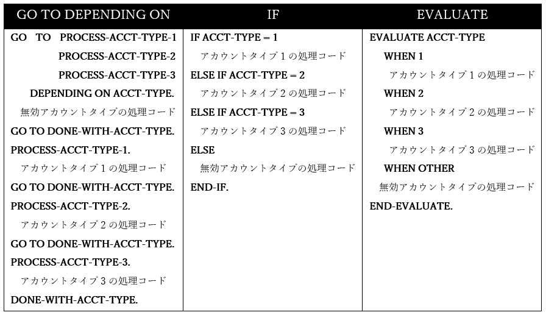

<!--navi start1-->
[前へ](6-22-1.md)/[目次](https://opensourcecobol.github.io/markdown/TOC.html)/[次へ](6-23.md)
<!--navi end1-->
### 6.22.2. GO TO文の書き方2 ― GO TO DEPENDING ON

図6-63-GOTO DEPENDING ON構文

文で指定された一意名の数値に応じて、指定された手続き名のいずれかに制御を移す。

1. 指定された一意名-1のPICTUREおよび/またはUSAGE句は、数値であり、編集できない、できれば符号なし整数データ項目として定義するようなものでなければならない。

2. 一意名-1の値が1の場合、制御は最初に指定された手続き名に移され、値が2の場合、制御は2番目の手続き名やその他に移る。

3. 一意名-1の値が1未満であるか、GO TO文で指定された手続き名の総数を超えている場合、制御はGO TOに続く次の文に移る。

4. 次の表は、実際の適用状況下でGO TO DEPENDING ONをどのように使うかを示し、IFとEVALUATEの二つと比較している。

    図6-64-GOTO DEPENDING ON vs IF vs EVALUATE

    

    「現代のプログラミング哲学」でEVALUATE文が好まれるのは間違いない。興味深いことに、IF文とEVALUATE文によって生成されたコードは実質的に同じである。新しいものは、必ずしも違いを意味するわけではなく、より良いと見なされる場合もある。

<!--navi start2-->

[ページトップへ](6-22-2.md)
<!--navi end2-->
