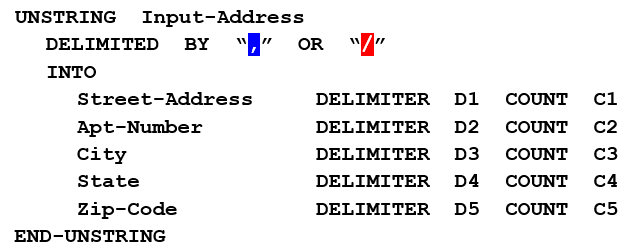

## 6.49. UNSTRING

図6-107-UNSTRING構文

UNSTRING文は文字列を解析し、そこから部分文字列を抽出する。

1. 一意名-1から一意名-5、一意名-7、および一意名-8は、英数字のUSAGE DISPLAYデータとして明示的または暗黙的に定義する必要があり、これらの一意名はいずれも集団項目の可能性がある。

2. 定数-1および定数-2は、英数字の定数でなければならない。

3. 一意名-6および一意名-9から一意名-11は、編集不可である基本の整数値項目でなければならない。

4. 一意名-10の値は0より大きい必要がある。

5. 一意名-1はソース文字列として知られ、一意名-4と一意名-7は宛先項目として知られている。

6. ソース文字列は、一意名-10で示される文字位置から(WITH POINTER句がない場合は1の場所から)始まる部分文字列に分割される。一意名-10の初期値が1未満、またはソース文字列のサイズよりも大きい場合、オーバーフロー状態になる。オーバーフローについては、この後の13項で説明する。

7. 部分文字列はDELIMITED BY句で指定された区切り文字列によって識別される。ALLオプションを使用すると、区切り文字順序を任意の長さの区切り文字定数のオカレンス順序にすることができるが、オプションがないと、各オカレンスは個別の区切り文字として扱われる。

8. 二つの連続する区切り文字順序は、空白の部分文字列を識別する。

9. ソース文字列が部分文字列に解析される例を次に示す：

    

    図6-108-STRING文の例

    

    示されているサンプルデータからUNSTRING文は合計5つの部分文字列を識別し、結果は次のMOVE文が実行されたかのようになる。

    

    すべての宛先項目に入力するのに十分な部分文字列を識別できない場合、データが見つからない部分文字列は変更されない。
    
    すべての部分文字列を受け取るのに十分な宛先項目が指定されていない場合、余分な部分文字列は「破棄」されるか「オーバーフロー」状態が存在する。オーバーフローについては、この後の13項で説明する。

10. 各宛先項目には、オプションのDELIMITER句を使用することができる。DELIMITER句が指定されている場合、一意名-5(または一意名-8)には、MOVEする宛先項目の部分文字列を識別するために使用される区切り文字列が含まれる。前に示した例を用いると、DELIMITER一意名に対して次の暗黙のMOVEが発生する。

     

11. 各宛先項目には、オプションのCOUNT句を使用することができる。COUNT句が指定されている場合、一意名-6(または一意名-9)には、MOVEする宛先項目の部分文字列のサイズが含まれる。前に示した例を用いると、COUNT一意名に対して次の暗黙のMOVEが発生する。

    

12. TALLYING句(存在する場合)は、解析された部分文字列が宛先項目にMOVEされるたびに1ずつインクリメントされる。この項目をゼロに初期化する場合は、UNSTRINGでは行われないため、自分で行う必要がある。

13. オプションのON OVERFLOW句が存在する場合、オーバーフロー条件が発生すると(6項および7項を参照)、命令文-1が実行される。ON OVERFLOW句がトリガーされた場合、NOT ON OVERFLOW句(存在する場合)は無視される。

14. オプションのNOT ON OVERFLOW句が存在せず、オーバーフロー条件が発生しない場合(6項および7項を参照)、命令文-2が実行される。NOT ON OVERFLOW句がトリガーされた場合、ON OVERFLOW句(存在する場合)は無視される

15. ソース文字列が解析されると、適切な宛先項目が更新され(DELIMITER / COUNT項目とともに)、一意名-11(TALLYING)がインクリメントされ、ON OVERFLOWまたはNOT ON OVERFLOW命令文が実行される。制御はUNSTRING文に続く次の文に移る。

---
`27` 空白文字列のMOVEは、空白のMOVEと同じである

`28` 最後の部分文字列には常に空白の区切り文字があり、DELIMITER項目にMOVEすると空白になる。
